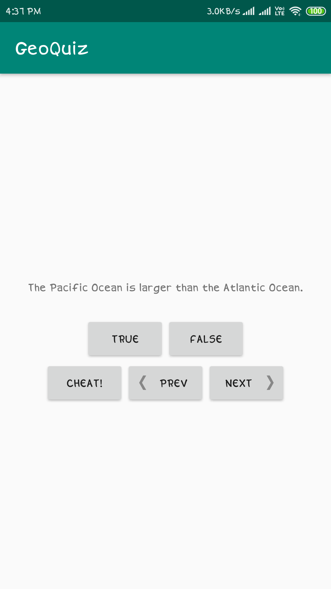
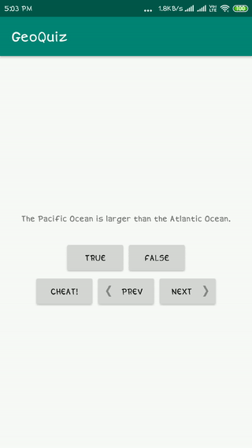
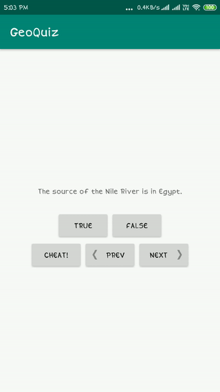
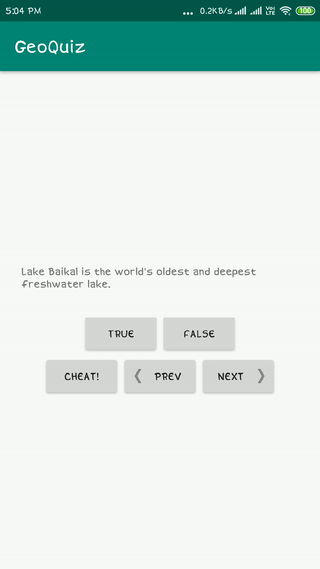

# GeoQuiz
This is a very basic android application which I developed while I was learning Android Development.  
It is a Quiz App which consists of five questions from Geography and also gives the user an option to cheat. But if the user cheats, he/she is penalized accordingly. On completing all five questions, a popup showing the percentage scored by the user is displayed.
## Screenshots
This app consists of two activities. The first one is the Main Activity, i.e the activity which opens on starting the app-
 
 

 
And, the second one is the Cheat Activity which opens up on pressing the cheat button-
 
 

## Working
The working of the app is shown using GIFs. The first GIF shows the Main Activity which pops up on starting the app-
 
 

 
The second GIF shows the Cheat Activity which pops up on pressing the cheat button-
 
 

 
The third GIF shows the Main Activity after the user answers all the five questions-
 
 

## Download APK

